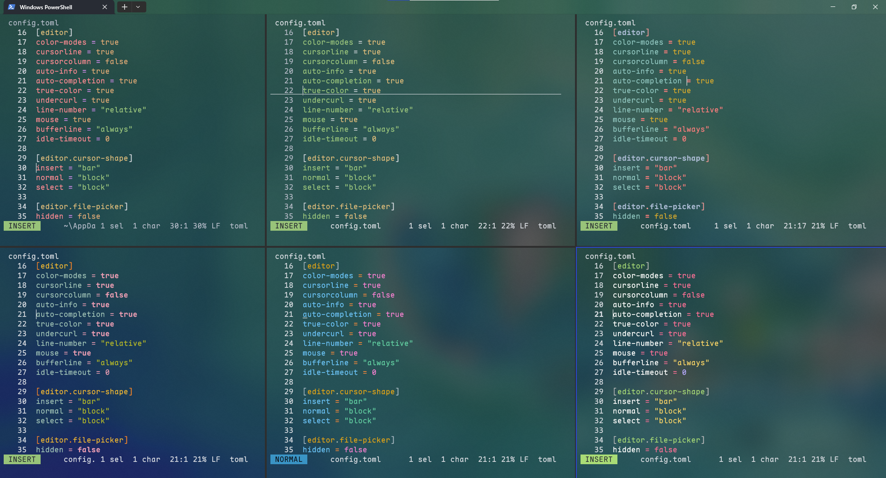

# *transparent-helix-themes*

>   Some transparent themes for helix and hope you love them!

## Installation

1.   Download or clone the repos.
2.   Put the folder `themes` to your helix config directory:
     *   Linux and Mac: `~/.config/helix/`
     *   Windows: `%AppData%\helix\`
3.   Open your hx, key in `:theme transparent` and preview the transparent themes.
4.   Choose a theme name to change `theme =`  in your `config.toml `file.
5.   Key in `:config-reload` and enjoy it!

